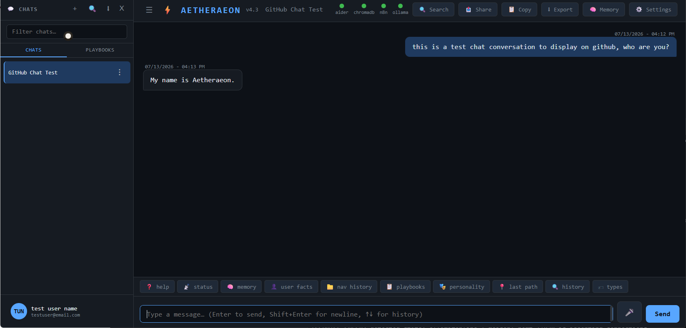
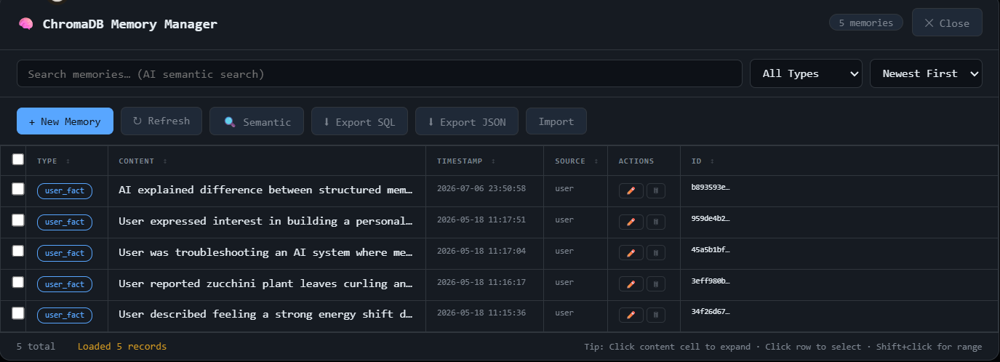
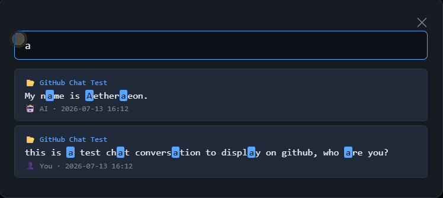
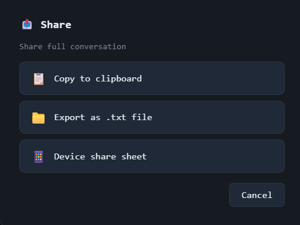
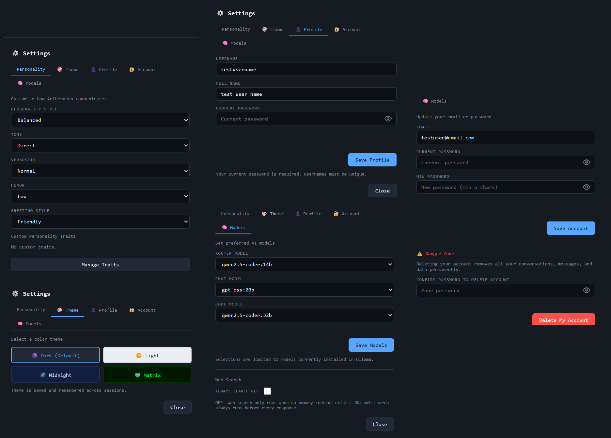
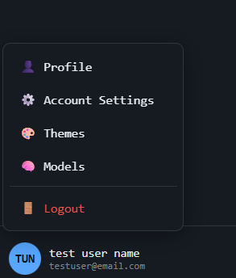
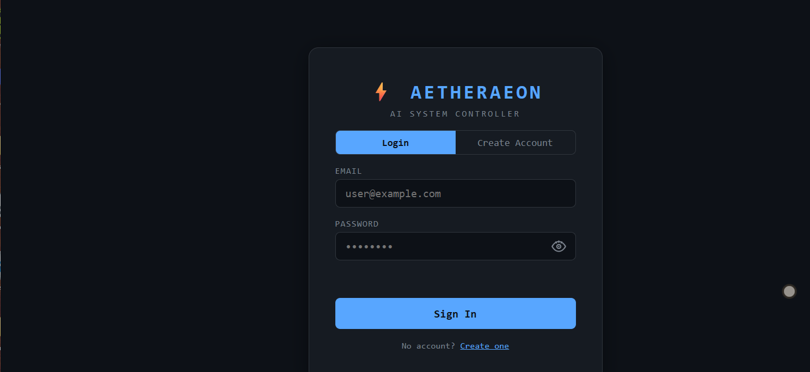
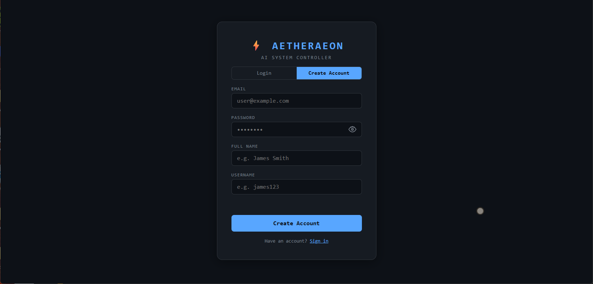
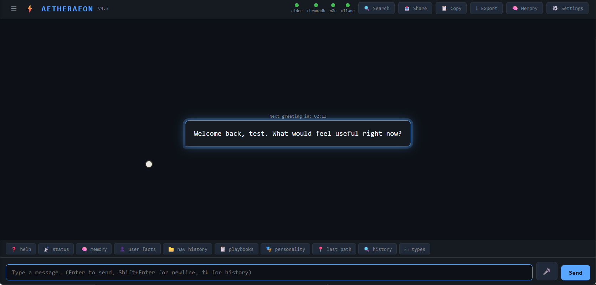

<h2 align="center">Preview</h2>

<table align="center">

  <tr>
    <td align="center">
      <b>Main Chat Interface</b><br>
      
    </td>
    <td align="center">
      <b>ChromaDB Memory System</b><br>
      
    </td>
    <td align="center">
      <b>Search</b><br>
      
    </td>
  </tr>

  <tr>
    <td align="center">
      <b>Share</b><br>
      
    </td>
    <td align="center">
      <b>Settings</b><br>
      
    </td>
    <td align="center">
      <b>User Menu</b><br>
      
    </td>
  </tr>

  <tr>
    <td align="center">
      <b>Login Screen</b><br>
      
    </td>
    <td></td>
    <td align="center">
      <b>Register Screen</b><br>
      
    </td>
  </tr>

</table>

<p align="center">
  <b>Welcome Dashboard</b><br>
  
</p>

# Aetheraeon AI

Aetheraeon AI is a self-hosted personal AI assistant for Windows. It combines local Ollama models, persistent conversations, MariaDB-backed application data, ChromaDB long-term memory, configurable personality, playbooks, and optional automation tools behind a Flask web interface.

The project is designed to run locally so the operator controls the application, model service, database, and stored data.

## Overview

The browser interface communicates with a Flask API gateway. The gateway coordinates authentication, conversations, model selection, memory, personality settings, tools, playbooks, service status, and greeting generation through the modules in `core/`.

The frontend is a static application under `WebUI/`:

```text
WebUI/
├── index.html
├── css/
│   └── aetheraeon.css
└── js/
    └── aetheraeon.js
```

## Features

- Local LLM chat through Ollama
- User registration, login, and account settings
- MariaDB-backed conversations and messages
- ChromaDB long-term memory with search, editing, import, and export controls
- Configurable personality, tone, detail, humor, and greeting style
- Automatic and manually refreshed greetings
- Conversation creation, renaming, pinning, searching, copying, sharing, and export
- Playbook creation and execution
- Optional web search, Aider, and n8n integrations
- Service status display for configured local services
- Dark, light, midnight, and matrix themes
- Responsive desktop and mobile layout
- Graceful login state when the Flask backend is unavailable

## Architecture

```text
Browser / WebUI
       │
       ▼
Flask API gateway (`core.api_gateway`)
       │
       ├── Request routing and orchestration
       ├── Ollama model interface
       ├── MariaDB persistence
       ├── ChromaDB memory
       ├── Personality and greeting systems
       ├── Tool and playbook execution
       └── Optional n8n, Aider, and web-search services
```

The backend remains the source of truth. Frontend JavaScript renders server data and sends requests through the existing `/api/*` endpoints.

For the detailed architecture, see [Docs/system_architecture_map.md](Docs/system_architecture_map.md).

## Installation

Follow the complete Windows installation guide in [Docs/INSTALL.md](Docs/INSTALL.md). In summary:

1. Install supported Python, MariaDB, Git, and Ollama versions.
2. Clone the repository.
3. Create and activate a virtual environment.
4. Install `requirements.txt`.
5. Import `database/aetheraeon_schema.sql` into MariaDB.
6. Copy `.env.example` to `.env` and configure local values.
7. Pull the required Ollama models.
8. Start the Flask backend with `python -m core.api_gateway`.
9. Open the configured local web address.

Do not commit `.env`, database data, Chroma data, user data, model storage, logs, or virtual environments.

## Requirements

The application requires:

- Windows 10 or Windows 11
- Python and the packages in `requirements.txt`
- MariaDB
- Ollama and the configured local models
- A modern browser

Node.js/npm, n8n, Aider, and Google Custom Search credentials are optional and apply only to their corresponding integrations.

See [Docs/DEPENDENCIES.md](Docs/DEPENDENCIES.md) for verified versions, ports, packages, services, and download locations.

## Local AI Setup

Aetheraeon sends local model requests to Ollama. Model roles and defaults are configured through `.env`, runtime settings, and the model registry. Install Ollama separately, start its service, and pull the models listed in the installation guide before starting Aetheraeon.

The application does not use the `Models/` folder as its active Ollama model store.

## Ollama Integration

Ollama supplies chat, routing, coding, title, and greeting model responses according to the current model settings. The WebUI model panel lists models reported as installed by the backend and saves selected model preferences through the settings API.

The default Ollama service address is documented in `.env.example` and [Docs/CONFIGURATION.md](Docs/CONFIGURATION.md).

## Memory System

Aetheraeon uses two persistence layers:

- MariaDB stores accounts, conversations, messages, settings, personality traits, and application logs.
- ChromaDB stores vector memory in the local runtime data directory.

The WebUI memory manager can list, search, create, update, delete, import, and export Chroma memory entries through existing backend endpoints. Runtime memory data is private and excluded from Git.

## Personality System

The personality system supports configurable communication style, response tone, detail level, humor, greeting style, and custom traits. Settings are stored through the backend and applied to model context and greeting generation.

## Security

- Passwords are handled by the backend and stored as hashes.
- Authentication state uses Flask sessions.
- Secrets and database credentials belong in `.env`, which is ignored by Git.
- The frontend does not include analytics, tracking scripts, or external JavaScript/CSS dependencies.
- Public deployment requires the operator to configure HTTPS, a production secret key, database access controls, firewall rules, and an appropriate reverse-proxy policy.

Review [Docs/CONFIGURATION.md](Docs/CONFIGURATION.md) and [Docs/INSTALL.md](Docs/INSTALL.md) before exposing the application outside a trusted local network.

## Screenshots

Screenshots are not currently bundled with the repository. Add sanitized images that contain no account details, private conversations, local paths, memory records, or service credentials before publishing them.

## Roadmap

The current release focus is installation reliability, documentation, frontend maintainability, and safe self-hosted operation. Proposed functional changes should be tracked as separate issues and reviewed before implementation so the working API, memory, authentication, and conversation flows remain stable.

## Contributing

Contributions should be narrowly scoped and preserve existing interfaces unless a change is explicitly approved.

1. Create a focused branch.
2. Keep runtime and development dependencies separated.
3. Do not commit secrets or generated user/runtime data.
4. Run Python and JavaScript syntax checks.
5. Verify login, chat, greetings, settings, memory, and static assets.
6. Document behavior changes and risks in the pull request.

Use [Docs/WEBUI_REVIEW_NOTES.md](Docs/WEBUI_REVIEW_NOTES.md) for known frontend recommendations that were intentionally not implemented during release cleanup.

## License

Aetheraeon AI is released under a custom **Source-Available Non-Commercial License**.

You are welcome to view, study, and use the project for personal, educational, and research purposes. Commercial use, redistribution, resale, hosting as a paid service, or inclusion in commercial products requires written permission from the copyright holder.

See the full license terms here:

[LICENSE](LICENSE)

Copyright © 2025-2026 James Meis